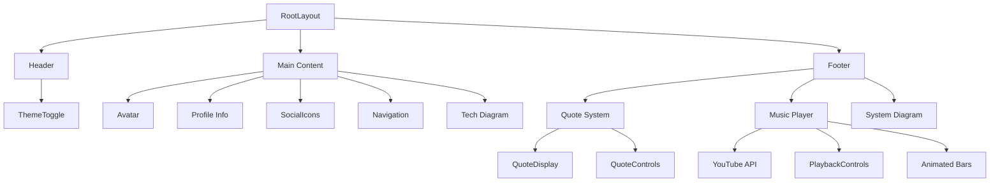
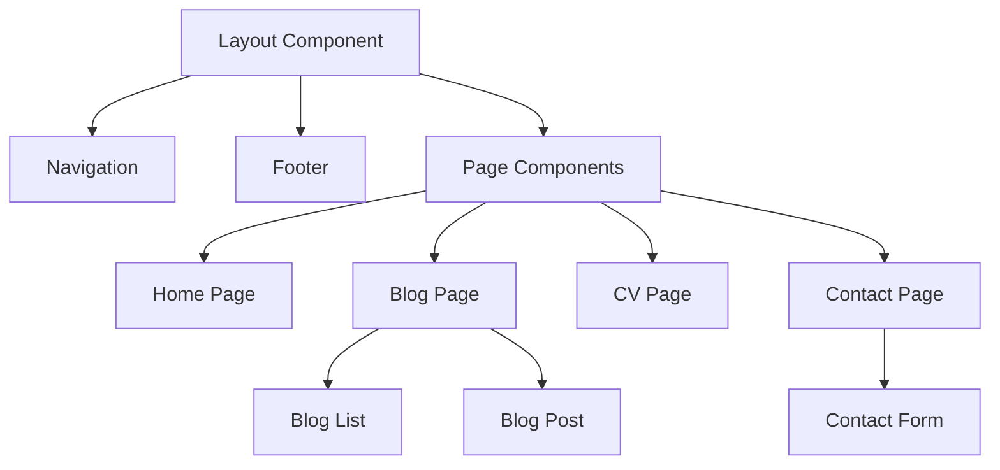

# System Patterns

## Architecture Overview
The portfolio website follows a component-based architecture using Next.js App Router and React Server Components where possible. The design emphasizes minimalism and technical aesthetics while maintaining high performance and accessibility.

## Component Hierarchy


## Key Design Patterns

### Theme Management
- Context-based theme management using next-themes
- Dark/light mode with smooth transitions
- Theme-aware component styling

### Component Patterns
1. **Atomic Components**
   - ThemeToggle: Theme switching with animated icons
   - Avatar: Profile image with animated border
   - SocialIcons: External link buttons with hover effects
   - Navigation: Internal routing with hover animations

2. **Feature Components**
   - Footer: Container for music player and quote system
   - QuoteSystem: Auto-rotating quotes with manual control
   - MusicPlayer: YouTube integration with visual feedback
   - SystemDiagram: Technical stack visualization

### State Management
1. **Theme State**
   - Global theme context
   - Persistent theme preference
   - Synchronized UI updates

2. **Music Player State**
   - YouTube IFrame API integration
   - Playback state management
   - Visual feedback synchronization

3. **Quote System State**
   - Auto-rotation with setInterval
   - Manual control override
   - Smooth transitions

### Animation Patterns
1. **Theme Transitions**
   - Smooth color transitions
   - Icon state animations
   - Background blur effects

2. **Interactive Elements**
   - Hover state animations
   - Focus state highlights
   - Click feedback

3. **Music Visualization**
   - Animated music bars
   - Play/pause state indication
   - Theme-aware colors

## Data Flow
1. **Theme Updates**
   ```mermaid
   graph LR
       ThemeToggle --> ThemeContext
       ThemeContext --> Components[All Components]
       ThemeContext --> LocalStorage
   ```

2. **Music Player**
   ```mermaid
   graph LR
       YouTubeAPI --> PlayerState
       PlayerState --> PlaybackControls
       PlayerState --> VisualFeedback
   ```

3. **Quote System**
   ```mermaid
   graph LR
       Timer --> QuoteState
       ManualControl --> QuoteState
       QuoteState --> Display
   ```

## Technical Implementation

### Theme System
```typescript
// Theme toggle with smooth transitions
const ThemeToggle = () => {
  const { theme, setTheme } = useTheme()
  return (
    <button onClick={() => setTheme(theme === 'dark' ? 'light' : 'dark')}>
      <Sun className="rotate-0 scale-100 transition-all dark:-rotate-90 dark:scale-0" />
      <Moon className="absolute rotate-90 scale-0 transition-all dark:rotate-0 dark:scale-100" />
    </button>
  )
}
```

### Music Player
```typescript
// Music player with animated bars
const MusicPlayer = () => {
  const [isPlaying, setIsPlaying] = useState(false)
  return (
    <div className="relative">
      <Music2 className={isPlaying ? 'text-primary' : 'text-gray-400'} />
      {isPlaying && (
        <div className="flex gap-[2px]">
          <div className="animate-music-bar1" />
          <div className="animate-music-bar2" />
          <div className="animate-music-bar3" />
        </div>
      )}
    </div>
  )
}
```

### Quote System
```typescript
// Auto-rotating quotes with manual control
const QuoteSystem = () => {
  const [quoteIndex, setQuoteIndex] = useState(0)
  
  useEffect(() => {
    const interval = setInterval(() => {
      setQuoteIndex(i => (i + 1) % quotes.length)
    }, 10000)
    return () => clearInterval(interval)
  }, [])

  return (
    <div className="flex items-center">
      <QuoteDisplay quote={quotes[quoteIndex]} />
      <RefreshButton onClick={() => setQuoteIndex(i => (i + 1) % quotes.length)} />
    </div>
  )
}
```

## Style Patterns
1. **Color System**
   - Primary/Secondary theme colors
   - Dark/light mode variants
   - Accent colors for interaction

2. **Typography**
   - Space Grotesk for headings
   - Inter for body text
   - Responsive font scaling

3. **Layout**
   - Mobile-first approach
   - Grid/Flex combinations
   - Responsive breakpoints

4. **Animations**
   - 300ms transitions
   - Ease-in-out timing
   - Hardware-accelerated transforms

## Design Patterns
1. **Component Patterns**
   - Atomic Design Methodology
   - Reusable UI components
   - Layout components for page structure
   - Container/Presenter pattern

2. **State Management**
   - React Context for global state
   - Local state for component-specific data
   - Server state management with Next.js

3. **Routing Patterns**
   - App Router file-based routing
   - Dynamic routes for blog posts
   - Nested layouts for consistent UI

4. **Data Flow**
   - Server-side data fetching
   - Static generation for blog content
   - Client-side data updates for forms

## Component Relationships


## Key Technical Decisions
1. **Next.js App Router**
   - Improved performance
   - Better SEO capabilities
   - Simplified routing

2. **MDX for Content**
   - Markdown for easy content creation
   - React components in content
   - Better content management

3. **Tailwind CSS**
   - Utility-first approach
   - Consistent design system
   - Easy responsive design

4. **TypeScript**
   - Type safety
   - Better developer experience
   - Improved maintainability

## System Constraints
[To be filled with system constraints] 