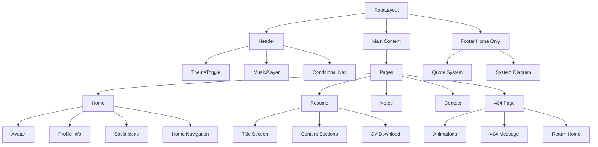
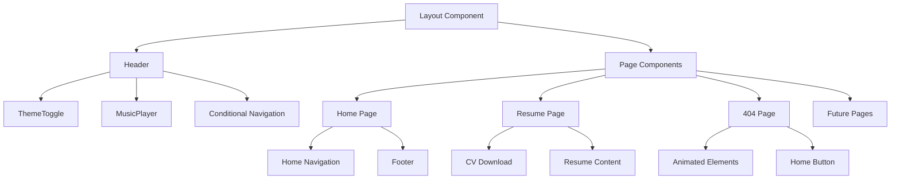

# System Patterns

## Architecture Overview
The portfolio website follows a component-based architecture using Next.js App Router and React Server Components where possible. The design emphasizes minimalism and technical aesthetics while maintaining high performance and accessibility.

## Component Hierarchy


## Key Design Patterns

### Theme Management
- Context-based theme management using next-themes
- Dark/light mode with instant icon switch
- Theme-aware component styling

### Navigation System
- Conditional navigation in header (hidden on home)
- Home-specific navigation component
- Consistent link styling and animations

### Component Patterns
1. **Atomic Components**
   - ThemeToggle: Simple icon switch
   - MusicPlayer: Integrated in header
   - Avatar: Profile image with animated border
   - SocialIcons: External link buttons
   - DownloadCV: Resume download button

2. **Page Components**
   - Home: Landing page with footer
   - Resume: Structured content with CV download
   - NotFound: Engaging 404 page with animations
   - Notes & Contact: Planned pages

3. **Feature Components**
   - Footer: Homepage-exclusive component
   - QuoteSystem: Auto-rotating quotes
   - SystemDiagram: Technical stack visualization

### Animation Patterns
1. **Theme Transitions**
   - Clean icon switches
   - Color transitions
   - Background blur effects

2. **Interactive Elements**
   - Hover state animations
   - Focus state highlights
   - Click feedback

3. **404 Page Animations**
   - Coffee cup steam effect
   - Moving debug bug
   - Home button rotation

## Technical Implementation

### Theme System
```typescript
const ThemeToggle = () => {
  const { theme, setTheme } = useTheme()
  return (
    <button onClick={() => setTheme(theme === 'dark' ? 'light' : 'dark')}>
      {theme === 'dark' ? <Moon /> : <Sun />}
    </button>
  )
}
```

### Navigation System
```typescript
const Header = () => {
  const isHome = usePathname() === '/'
  return (
    <header>
      {!isHome && <Navigation />}
      <ThemeToggle />
      <MusicPlayer />
    </header>
  )
}
```

### 404 Page Animations
```typescript
const NotFound = () => {
  const [bugPosition, setBugPosition] = useState({ x: 50, y: 50 })
  useEffect(() => {
    const interval = setInterval(() => {
      setBugPosition({
        x: Math.random() * 80 + 10,
        y: Math.random() * 80 + 10,
      })
    }, 2000)
    return () => clearInterval(interval)
  }, [])
  // ... render JSX
}
```

## Style Patterns
1. **Color System**
   - Primary/Secondary theme colors
   - Dark/light mode variants
   - Accent colors for interaction

2. **Typography**
   - Space Grotesk for headings
   - Inter for body text
   - Responsive font scaling

3. **Layout**
   - Mobile-first approach
   - Grid/Flex combinations
   - Responsive breakpoints

4. **Animations**
   - 200ms-300ms transitions
   - Ease-in-out timing
   - Hardware-accelerated transforms

## Component Relationships


## Key Technical Decisions
1. Footer exclusive to homepage
2. Conditional navigation in header
3. Animated 404 page for better UX
4. CV download in resume page
5. Theme toggle simplification

## Data Flow
1. **Theme Updates**
   ```mermaid
   graph LR
       ThemeToggle --> ThemeContext
       ThemeContext --> Components[All Components]
       ThemeContext --> LocalStorage
   ```

2. **Music Player**
   ```mermaid
   graph LR
       YouTubeAPI --> PlayerState
       PlayerState --> PlaybackControls
       PlayerState --> VisualFeedback
   ```

3. **Quote System**
   ```mermaid
   graph LR
       Timer --> QuoteState
       ManualControl --> QuoteState
       QuoteState --> Display
   ```

## System Constraints
[To be filled with system constraints] 