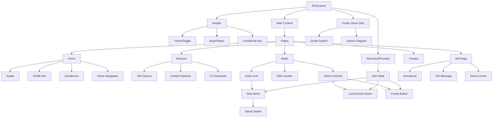
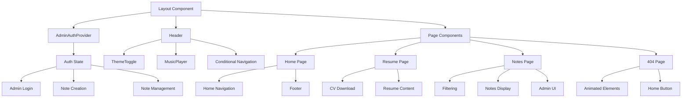
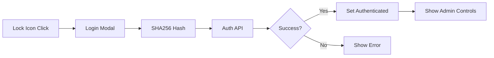
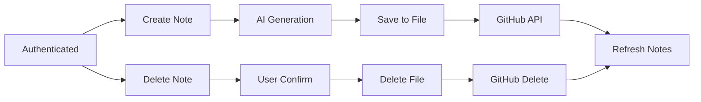
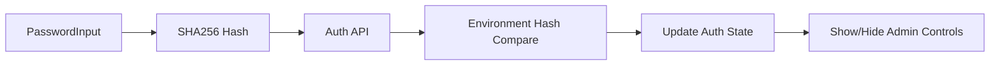
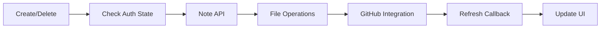
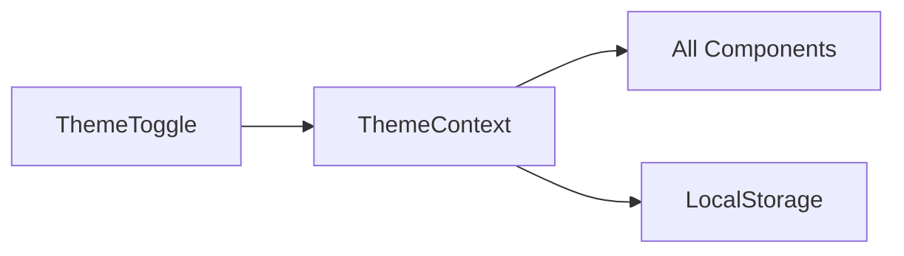
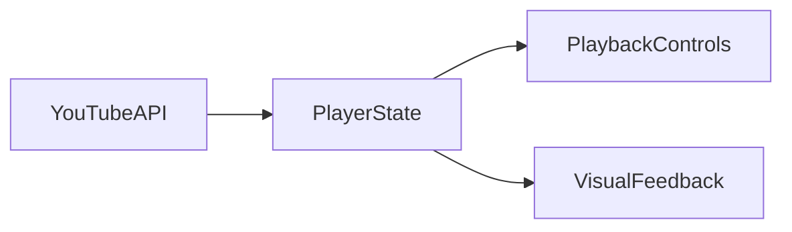

# System Patterns

## Architecture Overview
The portfolio website follows a component-based architecture using Next.js App Router and React Server Components where possible. The design emphasizes minimalism and technical aesthetics while maintaining high performance and accessibility. The system now includes a comprehensive admin authentication and note management system built with security and UX best practices.

## Component Hierarchy


## Key Design Patterns

### Admin Authentication System
- **React Context Pattern**: Global authentication state management
- **Floating UI Pattern**: Lock/unlock button with modal interface
- **Role-based Rendering**: Admin-only components (create/delete)
- **Security Pattern**: Client-side SHA256 hashing with environment variables

### Note Management System
- **CRUD Operations**: Create, Read, Update, Delete for notes
- **Confirmation Patterns**: User confirmation for destructive actions
- **State Synchronization**: Real-time updates with callback patterns
- **API Integration**: GitHub API for production deployment

### Theme Management
- Context-based theme management using next-themes
- Dark/light mode with instant icon switch
- Theme-aware component styling

### Navigation System
- Conditional navigation in header (hidden on home)
- Home-specific navigation component
- Consistent link styling and animations

### Component Patterns
1. **Authentication Components**
   - AdminAuthProvider: Context provider for global auth state
   - AdminLogin: Floating lock icon with secure modal
   - useAdminAuth: Custom hook for authentication state

2. **Note Management Components**
   - QuickCreateNote: AI-powered note creation (admin-only)
   - NoteItem: Enhanced note cards with delete functionality
   - NotesPage: Integrated admin controls

3. **Atomic Components**
   - ThemeToggle: Simple icon switch
   - MusicPlayer: Integrated in header
   - Avatar: Profile image with animated border
   - SocialIcons: External link buttons
   - DownloadCV: Resume download button

4. **Page Components**
   - Home: Landing page with footer
   - Resume: Structured content with CV download
   - Notes: Dynamic content with admin management
   - NotFound: Engaging 404 page with animations
   - Contact: Form with email integration

5. **Feature Components**
   - Footer: Homepage-exclusive component
   - QuoteSystem: Auto-rotating quotes
   - SystemDiagram: Technical stack visualization

### Animation Patterns
1. **Admin UI Animations**
   - Lock/unlock icon transitions
   - Hover-reveal delete buttons
   - Modal entrance/exit animations
   - Loading states with spinners

2. **Theme Transitions**
   - Clean icon switches
   - Color transitions
   - Background blur effects

3. **Interactive Elements**
   - Hover state animations
   - Focus state highlights
   - Click feedback

4. **404 Page Animations**
   - Coffee cup steam effect
   - Moving debug bug
   - Home button rotation

## Technical Implementation

### Admin Authentication Pattern
```typescript
// Context Provider
const AdminAuthProvider = ({ children }) => {
  const [isAuthenticated, setIsAuthenticated] = useState(false)
  
  const login = async (password: string) => {
    const hashedPassword = CryptoJS.SHA256(password).toString()
    const response = await fetch('/api/auth/quick-create', {
      method: 'POST',
      body: JSON.stringify({ password: hashedPassword })
    })
    if (response.ok) {
      setIsAuthenticated(true)
      return true
    }
    return false
  }
  
  return (
    <AdminAuthContext.Provider value={{ isAuthenticated, login, logout }}>
      {children}
    </AdminAuthContext.Provider>
  )
}

// Hook Usage
const useAdminAuth = () => {
  const context = useContext(AdminAuthContext)
  if (!context) {
    throw new Error('useAdminAuth must be used within AdminAuthProvider')
  }
  return context
}
```

### Note Management Pattern
```typescript
// Note Item with Delete
const NoteItem = ({ note, onNoteDeleted }) => {
  const { isAuthenticated } = useAdminAuth()
  
  const handleDelete = async () => {
    if (!confirm(`Delete "${note.title}"?`)) return
    
    const response = await fetch('/api/notes/delete', {
      method: 'DELETE',
      body: JSON.stringify({ filename: note.id })
    })
    
    if (response.ok) {
      onNoteDeleted?.()
    }
  }
  
  return (
    <div className="group relative">
      {isAuthenticated && (
        <button 
          onClick={handleDelete}
          className="opacity-0 group-hover:opacity-100"
        >
          <Trash2 />
        </button>
      )}
      {/* Note content */}
    </div>
  )
}
```

### Theme System
```typescript
const ThemeToggle = () => {
  const { theme, setTheme } = useTheme()
  return (
    <button onClick={() => setTheme(theme === 'dark' ? 'light' : 'dark')}>
      {theme === 'dark' ? <Moon /> : <Sun />}
    </button>
  )
}
```

### Navigation System
```typescript
const Header = () => {
  const isHome = usePathname() === '/'
  return (
    <header>
      {!isHome && <Navigation />}
      <ThemeToggle />
      <MusicPlayer />
    </header>
  )
}
```

## Security Patterns

### Password Security
```typescript
// Client-side hashing before transmission
const hashPassword = (password: string) => {
  return CryptoJS.SHA256(password).toString()
}

// Environment variable hash comparison
const ADMIN_PASSWORD_HASH = process.env.QUICK_CREATE_PASSWORD_HASH
```

### API Security
```typescript
// Path traversal protection
const sanitizedFilename = filename.replace(/[^a-zA-Z0-9-_]/g, '')
const resolvedPath = path.resolve(filePath)
if (!resolvedPath.startsWith(resolvedNotesDir)) {
  return NextResponse.json({ error: 'Invalid file path' }, { status: 400 })
}
```

### Input Validation
```typescript
// Filename sanitization
const fullFilename = sanitizedFilename.endsWith('.md') 
  ? sanitizedFilename 
  : `${sanitizedFilename}.md`
```

## API Patterns

### Authentication API
```typescript
// /api/auth/quick-create
export async function POST(request: NextRequest) {
  const { password } = await request.json()
  
  if (password === ADMIN_PASSWORD_HASH) {
    return NextResponse.json({ success: true })
  }
  
  return NextResponse.json({ error: 'Invalid password' }, { status: 401 })
}
```

### CRUD Operations
```typescript
// /api/notes/delete
export async function DELETE(request: NextRequest) {
  const { filename } = await request.json()
  
  // Security validation
  // File deletion
  // GitHub API integration
  
  return NextResponse.json({ success: true })
}
```

## Style Patterns
1. **Admin UI Styling**
   - Floating controls with z-index management
   - Hover-reveal patterns with opacity transitions
   - Modal overlays with backdrop blur
   - Confirmation dialogs with proper focus management

2. **Color System**
   - Primary/Secondary theme colors
   - Dark/light mode variants
   - Accent colors for interaction
   - Status colors (success/error/warning)

3. **Typography**
   - Space Grotesk for headings
   - Inter for body text
   - Responsive font scaling

4. **Layout**
   - Mobile-first approach
   - Grid/Flex combinations
   - Responsive breakpoints
   - Admin overlay positioning

5. **Animations**
   - 200ms-300ms transitions
   - Ease-in-out timing
   - Hardware-accelerated transforms
   - Loading state animations

## Component Relationships


## State Management Patterns

### Authentication Flow


### Note Management Flow


## Key Technical Decisions
1. **Authentication**: Single admin user with SHA256 hashing (simplicity over OAuth)
2. **State Management**: React Context for global admin state
3. **UI Pattern**: Floating controls for clean admin interface
4. **Security**: Client-side hashing with environment variable validation
5. **Deployment**: GitHub API integration for production note management
6. Footer exclusive to homepage
7. Conditional navigation in header
8. Animated 404 page for better UX
9. CV download in resume page
10. Theme toggle simplification

## Data Flow

### Authentication Data Flow


### Note Management Data Flow


### Theme Updates


### Music Player
